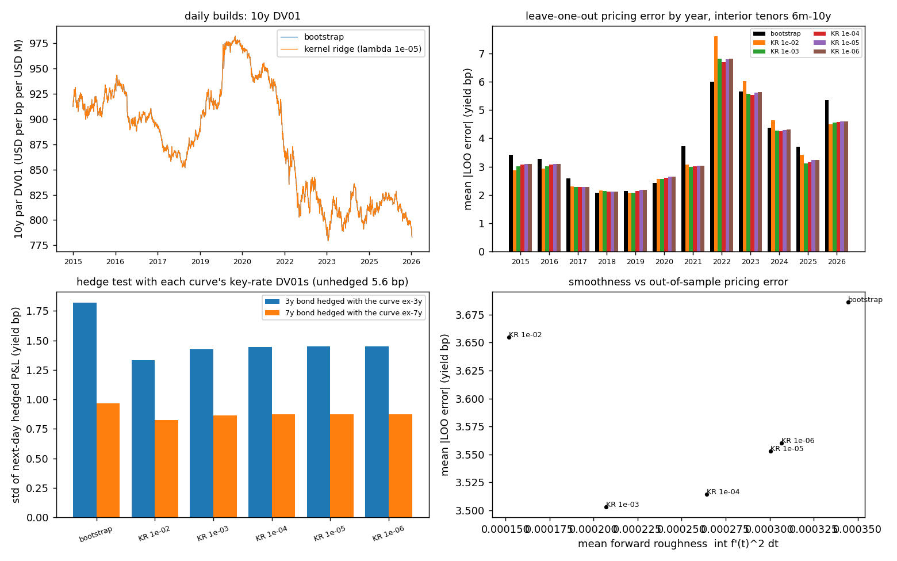
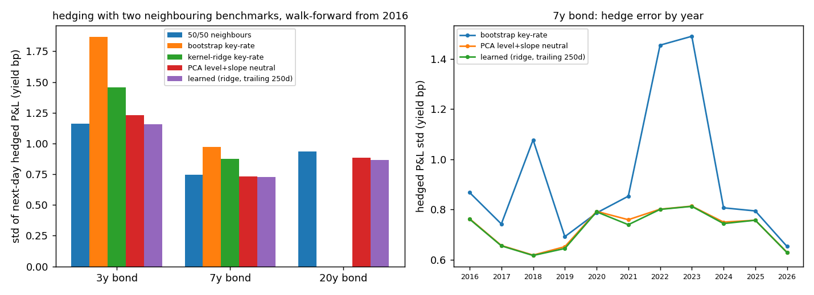
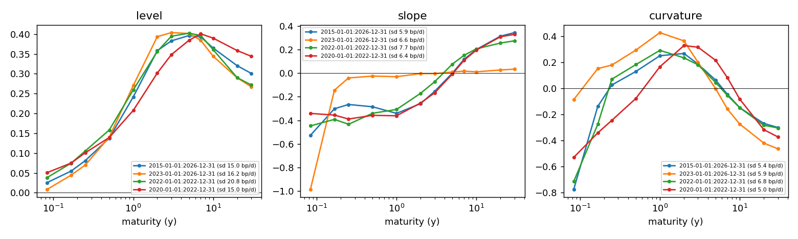
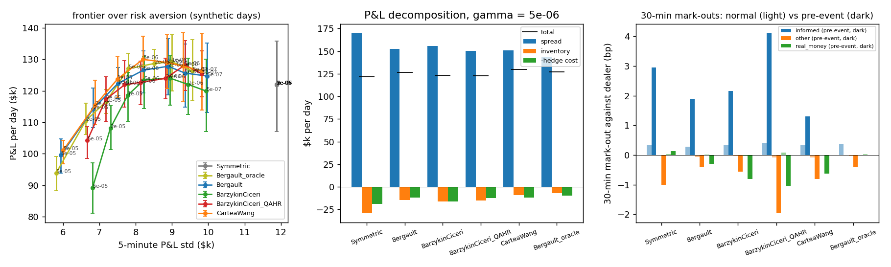
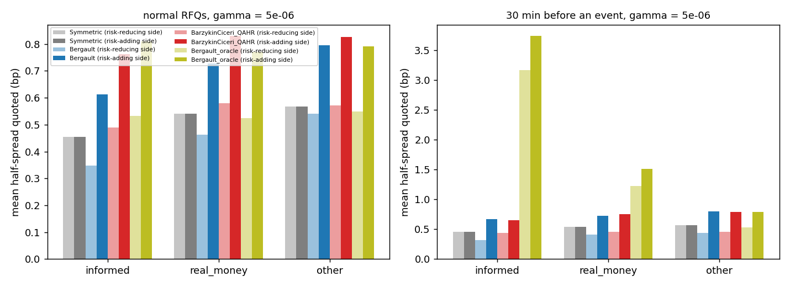
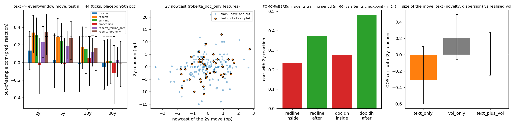
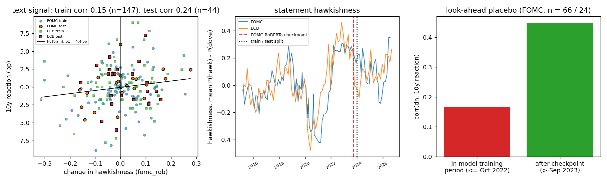
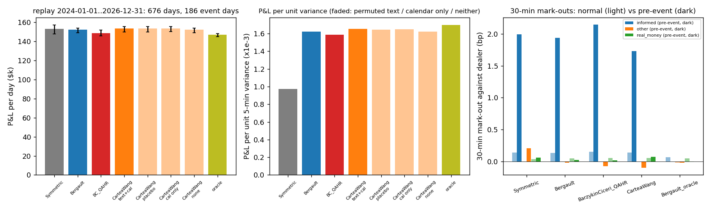

# rates-curve-nlp — machine-learned yield curves for pricing, hedging and quoting

**Question.** A Treasury RFQ desk needs a curve to price, a curve to hedge and a view on what central-bank statements will do to the curve. Does machine learning improve on the classical answers — a Hagan–West bootstrap for the curve, key-rate DV01s for the hedge, a lexicon for the text — when each is tested strictly out of sample on 2015–2026 Treasury data and FOMC / ECB statements, and does any of it pay in an RFQ simulator with informed flow and scheduled events?

**Answer (§Results).** Yes for the curve and the hedge; yes but small for the text; the closed-form quoting stack is the benchmark that none of it moves much.
- *Curve.* A kernel-ridge discount curve (Filipović–Pelger–Ye), with the smoothing chosen by a rule fixed in advance (smoothest fit that still reprices within 1 bp), beats the monotone-convex bootstrap on 2,927 daily builds: leave-one-out pricing error −3.6 % (median −10 %), forward roughness −13 %, hedge error of an off-curve 3y / 7y bond −20 % / −10 %, with identical DV01 stability. It is better in 8 of 12 years (worse in 2018-20 and 2022, the years when the curve was flattest or moved most).
- *Hedge.* Hedge ratios learned from co-movements (ridge on a trailing 250-day window, walk-forward) cut the next-day hedge error of a 3y / 7y bond by 38 % / 25 % relative to the bootstrap's key-rate DV01s (bootstrap CI on the ratio [0.55, 0.69] / [0.70, 0.79]) and by 20 % / 17 % relative to the kernel-ridge curve's — the interpolation puts weight on distant tenors that the data say should not be there.
- *Text (NLP).* FOMC-RoBERTa hawkishness of the statement, changed versus the previous one, nowcasts the 2y event-window move out of sample: corr 0.34 (bootstrap CI [0.09, 0.54], n = 44 events in 2024–26, permutation p = 0.022), R² 9 %; 5y 0.27, 10y 0.16, 30y nil. The front end is where the text bites. A lexicon gets 0.13 (not significant) and sentence embeddings + ridge get nothing (-0.03) at n ≈ 150 — the model that read 25 years of Fed language beats both. The dated-checkpoint split shows no look-ahead (corr 0.27 inside the model's training period vs 0.48 after its checkpoint).
- *Quotes and events.* On synthetic days the closed forms behave as the papers say (Bergault's factor skew cuts the 5-minute P&L std by 27 % at equal P&L); on the 2024–26 replay (676 real days, 186 event days, measured USMPD jumps on FOMC days) the calendar feature — widen the informed tier in the 30 minutes before a scheduled event — adds +1.0 % P&L and +1.8 % P&L per unit variance, and the text nowcast, used only in the 30 minutes *after* release, adds -0.2 %: statistically real, economically not tradable at this size, exactly the trap the plan warned about.

Literature cut-off June 2026. Header-only C++20 behind one CLI (`rcmm`), Python for downloads, text scoring, figures and the report. 1,831 tests; CI builds with g++ and runs them plus a short pipeline on a checked-in CMT sample.

---

## Layout

| path | what |
|---|---|
| `tools/download.py` | free data: Treasury CMT par yields, NY Fed SOFR / EFFR, FOMC and ECB statements, SF Fed USMPD, CFTC TFF, Treasury auctions |
| `include/rcmm/curve.hpp` | Hagan–West monotone-convex interpolation (closed-form sector integrals), global bootstrap of bills + par bonds + OIS, key-rate DV01s, meeting-date step front end, kernel-ridge discount curve |
| `include/rcmm/data.hpp`, `factors.hpp` | CMT loader, PCA (Jacobi) level / slope / curvature, loadings interpolated to any maturity |
| `include/rcmm/mm.hpp` | ladder, client tiers, `Symmetric`, `Bergault` (+ `CarteaWang` signal, + `_oracle` that knows the client model), `BarzykinCiceri` (± quality-adjusted hit ratio) |
| `include/rcmm/sim.hpp` | event-driven RFQ simulator: factor curve on a 1-minute grid (common random numbers), informed pre-event flow, event jumps split between the release and a 30-minute discovery window, drifts, band hedging, mark-outs, exact P&L decomposition |
| `src/main.cpp` → `rcmm` | `curve`, `curvehist` (daily builds, LOO, hedge test), `factors`, `mm`, `events` |
| `tools/hedge_test.py` | learned vs model hedge ratios, walk-forward |
| `tools/text_features.py`, `tools/nlp_features.py`, `tools/event_features.py` | sentence-level hawkishness (lexicon, FOMC-RoBERTa dated checkpoint, 2026 open re-implementation); redline / novelty / embedding features and the out-of-sample nowcast models with placebos; USMPD reactions, NFP / auction calendar, CFTC and funding-stress features → `data/derived/events.csv`, `results/nlp_signal.json` |
| `tests/tests.cpp` | interpolation and closed-form integrals, repricing, DV01 sums, step fit, PCA, Riccati identity, quote signs, calendar widening, hit-ratio controller, P&L identities, CRN, adverse selection, bridge, release-window signal |
| `scripts/run_all.sh`, `plots.py`, `summarize.py`, `report.py` | pipeline, figures, `results/summary.md`, `report.pdf`; `notebooks/results.ipynb` |

Build: `./build.ps1` (MSVC + Ninja) or `cmake -S . -B build -G Ninja && cmake --build build`. Python: `numpy pandas matplotlib requests openpyxl fpdf2`, plus `torch transformers sentence-transformers` for the model scorers (the lexicon scorer needs none of them).

---

## Data

| layer | source | notes |
|---|---|---|
| curve inputs | Treasury daily par yield curve (CMT), 2015-01-02 – 2026-09-15, 2,927 days | bills (≤ 1y) as simple-yield instruments, 2y–30y as semi-annual par bonds; 4M dropped; 2M exists from Oct 2018 |
| front end | NY Fed SOFR / EFFR fixings, bills | CME SOFR futures are not downloadable without a browser session; the step front end accepts them (`--futures`) and is otherwise fitted from bills — a proxy |
| SOFR OIS | not free | the curve is the Treasury curve; the OIS code path is exercised only in tests |
| events | FOMC statements (99), ECB monetary-policy statements (94), SF Fed USMPD event-window reactions, Treasury auctions (10y / 30y), CFTC TFF 10y note positioning, SOFR − EFFR and SOFR 99th percentile | NFP dates by the BLS rule (third Friday after the week of the 12th); CPI dates could not be fetched (BLS blocks scripted access) and are not used |
| client flow | simulated | three tiers, calibrated by hand (§Method); no public single-dealer RFQ data exists |

---

## Method

**Curve.** Instantaneous forward on $[t_{i-1}, t_i)$: $f(t) = f^d_i + g(x)$, $x = (t - t_{i-1})/(t_i - t_{i-1})$, with the four Hagan–West sectors of $g$ and their closed-form integrals ($\int_0^1 g = 0$, so each interval reproduces its discrete forward). The bootstrap sweeps the instruments (secant on each $f^d_i$) until all reprice; it reaches $10^{-7}$ bp in 5 sweeps. Key-rate DV01 $= -\partial P/\partial y_k$ per bp of input $k$; they sum to the parallel DV01 (test). Kernel ridge: $d(t) = 1 - \beta t - \sum_j w_j k(t, t_j)$, $k(s,t) = \min(s,t)^2\,(3\max(s,t) - \min(s,t))/6$ (the reproducing kernel of $\int d''^2$), $\beta$ the unpenalised linear part, $\min_w \sum_i \omega_i (P_i - 1)^2 + \lambda\, w^\top K w$. The front end is a piecewise-constant forward on meeting dates fitted to average-forward observations.

**Out-of-sample tests (daily, 2015–2026).** Leave-one-out: each interior tenor (6m–10y) is dropped and repriced off the curve built from the rest; errors in yield bp (price error / $\partial P/\partial y$). Hedge test: the 3y (7y) bond is priced off the curve built *without* that point and hedged with the remaining inputs using that curve's key-rate DV01s; the realised next-day P&L of the package, in yield bp, is the score. Learned hedge: $\Delta y_T \approx w_a \Delta y_a + w_b \Delta y_b$ with $w$ from ridge on the trailing 250 days, the PCA level+slope-neutral pair, or 50/50 — all walk-forward.

**Factors.** PCA of daily par-yield changes on 12 tenors; $\Sigma_{\text{ladder}} = \sum_k \lambda_k L_k L_k^\top$ at the ladder maturities; inventory $q_j$ in $/bp; risk $q^\top \Sigma q$ ($\$^2$/day).

**Quoters** (half-spread $\delta$ in bp per RFQ; hit probability $f_i(\delta) = 1/(1 + e^{\alpha_i + \beta_i\delta})$ per tier):
- Symmetric: $f_i(\delta_i) = h^\ast$.
- Bergault et al.: Riccati approximation with exponential intensities fitted at $\arg\max_\delta \delta f(\delta)$,
  $$\Gamma = D^{-1/2}\big(D^{1/2}\tfrac{\gamma}{2}\Sigma D^{1/2}\big)^{1/2}D^{-1/2},\quad D_j = A_j z_j k_j/e,\qquad \delta_j^{\pm} = \tfrac1k + \tfrac12\Gamma_{jj}z \mp (\Gamma q)_j .$$
  `_oracle` adds each tier's expected adverse selection ($\mu_i z/10$; in the pre-event window $p_i\,E|\text{jump}_j|$) — the closed form given the true client model.
- Cartea–Wang: Bergault shifted by $\mp h\hat\alpha_j$ (capped at 1 bp), where $\hat\alpha_j$ is the text nowcast of the tenor-$j$ window move, available only from the release for 30 minutes; plus the calendar feature (+0.5 bp for the informed tier in the 30 minutes before a scheduled event).
- Barzykin–Ciceri: riskless spread + inventory correction + $\kappa\delta_0(\hat h - h^\ast)/h^\ast$; QAHR variant counts a hit whose 30-minute mark-out exceeds the spread as $1 + \min(2, (\text{mark-out} - \delta)/\delta)$ hits.

**Simulator.** Poisson RFQs per (tier, tenor, side), sizes 5 / 10 / 25 $M; a fill moves inventory by $\pm z\,\text{DV01}_j$ and earns $z\,\text{DV01}_j\,\delta$; informed clients drift the yield against the dealer for 30 minutes and, 30 minutes before an event, trade in the direction of the coming jump with probability $p_i$ at `info_mult` × normal intensity; curve on the factor model, events as jumps (measured USMPD window moves on real FOMC days) of which half lands at the release and half accrues over the next 30 minutes, Brownian bridge to the realised close on real days; inventory beyond ±$10k/bp per tenor hedged every 5 minutes at 0.15 bp. P&L = spread + inventory − hedge cost exactly. Tiers: informed (0.4 RFQ/h/tenor/side, β = 4, p = 0.6, μ = 0.2 bp per $10M), real money (0.8, 3, 0.15, 0.05), other (1.2, 2.5, 0, 0).

**Text.** Each statement is split into sentences; hawkishness $h$ = mean of $P(\text{hawk}) - P(\text{dove})$ under FOMC-RoBERTa (or the lexicon), with its dispersion; the *redline* = sentences added minus sentences removed versus the previous statement; novelty = share of sentences changed; a 384-d MiniLM embedding of the redline. Targets: USMPD 30-minute window reactions (FOMC) and daily changes (ECB days, US curve) at 2y / 5y / 10y / 30y. Ridge models fitted on statements to 2023-12-31 (pooled Fed + ECB, n = 147; λ by leave-one-out inside the training set), tested on 2024–26 (n = 44): bootstrap CIs, a permutation test of the out-of-sample correlation, a refit-on-permuted-targets placebo, and the dated-checkpoint split. The replay uses the per-tenor nowcast of the feature set with the best training-window LOO correlation, during the 30 minutes after each release; variants: nowcast as given, permuted across events, calendar only, neither.

---

## Results

### Curve: kernel ridge vs bootstrap (2,927 daily builds)

| method | λ | max reprice (bp) | LOO |err| (yield bp) | median | roughness | hedged 3y std (bp) | hedged 7y std (bp) | 10y DV01 daily-change std |
|---|---|---|---|---|---|---|---|---|
| bootstrap | – | 3e-7 | 3.686 | 3.457 | 3.44e-4 | 1.822 | 0.965 | 2.248 |
| kernel ridge (selected) | 1e-5 | 0.32 | 3.553 | 3.097 | 3.00e-4 | 1.451 | 0.873 | 2.252 |
| kernel ridge | 1e-3 | 5.3 | 3.503 | 2.996 | 2.07e-4 | 1.424 | 0.866 | 2.252 |

The selection rule (largest λ that reprices within 1 bp on every day) was fixed before looking at the errors; the looser λ = 10⁻³ would do slightly better still but violates the 1 bp repricing target on 2022-style days. The kernel ridge wins in 8 of 12 years (table below; it loses in 2018-20 and 2022). Unhedged 7y daily std is 5.55 bp, so both curves remove > 80 % of the variance; the kernel ridge removes 10 % more of what is left.

| bond | hedge ratios | hedged std (yield bp) | vs bootstrap key-rate |
|---|---|---|---|
| 3y | bootstrap key-rate DV01s | 1.868 | – |
| 3y | kernel-ridge key-rate DV01s | 1.456 | −22 % |
| 3y | PCA level+slope neutral | 1.230 | −34 % |
| 3y | learned (ridge, trailing 250 d) | 1.158 | −38 % [CI −45 %, −31 %] |
| 7y | bootstrap key-rate DV01s | 0.974 | – |
| 7y | kernel-ridge key-rate DV01s | 0.873 | −10 % |
| 7y | PCA level+slope neutral | 0.731 | −25 % |
| 7y | learned (ridge, trailing 250 d) | 0.728 | −25 % [CI −30 %, −21 %] |

Stated plainly: the learned ratio is close to the duration-matched 50/50 split (1.159 / 0.745). What the curve models get wrong is spreading the hedge over distant inputs; the smoother curve gets it less wrong, the data-driven ratio not at all.

### Factor risk

Three factors explain 91 % of daily variance over 2015–2026 (92 % over 2023–26); level sd 15–16 bp/day (20.8 in 2022, the shift regime used below).

### Quoting: the closed forms

Synthetic days from the 2023-26 factor model, 40 days x 8 seeds, common random numbers; gamma = 2e-6 unless stated. The frontier over gamma is in the figure.

| quoter | P&L/day $k [95 % CI] | 5-min std $k | P&L/var x1e-3 | spread / inventory / hedge | P&L at gamma=5e-6 | std at gamma=5e-6 |
|---|---|---|---|---|---|---|
| Symmetric | 121.4 [106, 135] | 12.9 | 0.73 | 170 / -30 / -19 | 121.4 | 12.9 |
| Bergault | 127.2 [118, 136] | 9.5 | 1.42 | 161 / -20 / -14 | 126.1 | 8.7 |
| BarzykinCiceri_QAHR | 123.4 [117, 129] | 9.3 | 1.44 | 156 / -19 / -13 | 123.3 | 8.5 |
| Bergault_oracle | 128.5 [124, 133] | 8.7 | 1.68 | 150 / -10 / -11 | 126.7 | 8.0 |
| CarteaWang | 144.0 [130, 157] | 15.2 | 0.62 | 147 / 13 / -16 | 144.8 | 13.8 |

The factor skew (Bergault) buys a 27 % lower 5-minute P&L std for the same P&L; the quality-adjusted hit ratio removes toxic hits at the cost of volume; the oracle that knows the client model earns the most per unit variance; Cartea-Wang with the synthetic signal (corr 0.5 with the coming jump) earns the most P&L at the highest variance. Mark-outs: informed pre-event fills cost 2-4 bp at 30 minutes against 0.1-0.4 bp normally (right panel).

Quote structure at γ = 2·10⁻⁶: Bergault skews ±0.1–0.2 bp with the sign of the fill's marginal risk; the oracle, which knows the tiers' toxicity, widens the informed tier by 0.2 bp normally and by 3 bp in the pre-event window.

### NLP: what the statements predict

Out of sample (statements after 2023-12-31, n = 44); models fitted on n = 147 earlier statements. Feature sets: `roberta_doc_only` = change in FOMC-RoBERTa document hawkishness; `roberta_redline_only` = hawkishness of added minus removed sentences; `roberta` adds level, dispersion and novelty; `lexicon` = the same from the word list; `embedding` = 384-d MiniLM redline embedding.

| features | tenor | LOO corr (train) | OOS corr [CI] | permutation p | OOS R² | sign hit |
|---|---|---|---|---|---|---|
| roberta_doc_only | 2y | 0.17 | 0.34 [0.09, 0.54] | 0.022 | 0.091 | 0.57 |
| roberta_doc_only | 5y | 0.17 | 0.27 [0.03, 0.46] | 0.068 | 0.074 | 0.57 |
| roberta_doc_only | 10y | 0.07 | 0.16 [-0.09, 0.37] | 0.282 | 0.025 | 0.52 |
| roberta_doc_only | 30y | -0.53 | -0.01 [-0.27, 0.24] | 0.947 | -0.005 | 0.59 |
| roberta_redline_only | 2y | 0.12 | 0.23 [0.05, 0.41] | 0.131 | 0.040 | 0.55 |
| roberta_redline_only | 5y | 0.11 | 0.19 [0.04, 0.36] | 0.209 | 0.031 | 0.55 |
| roberta_redline_only | 10y | 0.03 | 0.12 [-0.04, 0.27] | 0.415 | 0.011 | 0.50 |
| roberta_redline_only | 30y | -0.37 | 0.03 [-0.17, 0.18] | 0.866 | -0.004 | 0.57 |
| roberta | 2y | 0.07 | 0.34 [0.11, 0.53] | 0.023 | 0.075 | 0.48 |
| roberta | 5y | 0.08 | 0.29 [0.02, 0.50] | 0.052 | 0.076 | 0.57 |
| roberta | 10y | 0.00 | 0.18 [-0.07, 0.41] | 0.235 | 0.015 | 0.48 |
| roberta | 30y | -0.12 | 0.01 [-0.26, 0.26] | 0.941 | -0.036 | 0.45 |
| all_hand | 2y | 0.00 | 0.31 [0.08, 0.51] | 0.037 | 0.070 | 0.48 |
| all_hand | 5y | 0.02 | 0.25 [-0.02, 0.45] | 0.100 | 0.060 | 0.59 |
| all_hand | 10y | -0.02 | 0.15 [-0.12, 0.40] | 0.325 | 0.011 | 0.50 |
| all_hand | 30y | -0.12 | 0.01 [-0.24, 0.26] | 0.935 | -0.039 | 0.43 |
| lexicon | 2y | -0.33 | 0.13 [-0.08, 0.35] | 0.392 | 0.008 | 0.50 |
| lexicon | 5y | -0.28 | 0.02 [-0.29, 0.33] | 0.871 | -0.007 | 0.57 |
| lexicon | 10y | -0.12 | -0.02 [-0.34, 0.30] | 0.898 | -0.025 | 0.50 |
| lexicon | 30y | -0.00 | -0.05 [-0.31, 0.25] | 0.750 | -0.061 | 0.50 |
| embedding | 2y | 0.09 | -0.03 [-0.36, 0.28] | 0.843 | -4.243 | 0.52 |
| embedding | 5y | -0.06 | -0.02 [-0.34, 0.27] | 0.905 | -7.494 | 0.55 |
| embedding | 10y | -0.12 | 0.05 [-0.26, 0.29] | 0.737 | -0.223 | 0.57 |
| embedding | 30y | -0.14 | -0.12 [-0.47, 0.19] | 0.440 | -0.147 | 0.45 |

Dated-checkpoint split (FOMC only; FOMC-RoBERTa checkpoint 2023-09-26, training text to Oct 2022): corr(Δh, 2y) 0.27 inside the training period (n = 66) vs 0.48 after the checkpoint (n = 24); redline 0.23 vs 0.37. Size of the move: novelty and dispersion do not predict |2y move| out of sample (corr -0.31); 20-day realised vol does weakly (0.21). Models and commits: `results/nlp_signal.json`.

### Events: the real-day replay

Real days 2024-01-02 to 2026-09-15 (676 days; events: AUCTION 111, ECB 22, FOMC 22, NFP 31; 21 FOMC days with measured USMPD jumps, other events 0.6 × the daily move), γ = 2·10⁻⁶, 3 seeds. The nowcast is applied only in the 30 minutes after a release.

| quoter | variant | P&L/day $k [CI] | 5-min std | P&L/var ×10⁻³ | inventory P&L |
|---|---|---|---|---|---|
| Symmetric | - | 152.8 [148, 157] | 12.5 | 0.97 | -10.1 |
| Bergault | - | 152.1 [149, 154] | 9.7 | 1.62 | -6.2 |
| BarzykinCiceri_QAHR | - | 148.3 [146, 152] | 9.7 | 1.59 | -6.0 |
| CarteaWang | text+calendar | 153.4 [150, 156] | 9.6 | 1.65 | -4.0 |
| CarteaWang | placebo_text+calendar | 153.5 [150, 156] | 9.7 | 1.64 | -3.8 |
| CarteaWang | calendar_only | 153.6 [150, 155] | 9.6 | 1.65 | -3.9 |
| CarteaWang | none | 152.1 [149, 154] | 9.7 | 1.62 | -6.2 |
| Bergault_oracle | - | 146.9 [145, 148] | 9.3 | 1.70 | -1.3 |

The calendar feature is worth +1.0 % of P&L (+1.8 % per unit variance); the nowcast on top of it -0.2 %, indistinguishable from its permuted placebo. With the factor model fitted without 2020–22 (`events_ex2020.json`) the ordering is unchanged. The single-number text signal of the earlier arm (`results/text_signal*.json`: b₁ = 4.4 bp per unit Δh on the 10y, OOS corr 0.24) is superseded by the per-tenor nowcast above.

---

## Validation

- Bootstrap reprices every input to $< 10^{-6}$ bp on all 2,927 days; kernel ridge at the selected λ within 0.32 bp (target 1 bp).
- Key-rate DV01s sum to the parallel DV01; closed-form sector integrals match quadrature; the step front end recovers known steps (tests).
- Every out-of-sample number above is walk-forward or leave-one-out; the λ rule and the hedge test were fixed before the numbers were seen; bootstrap CIs on the hedge ratios.
- $\Gamma D\Gamma = \tfrac{\gamma}{2}\Sigma$ to $10^{-6}$; quotes skew the right way; $\gamma \to 0$ recovers $\arg\max \delta f(\delta)$; calendar widening tested.
- P&L decomposition sums exactly; 5-minute increments sum to the total; identical quotes on the same seed give identical P&L (common random numbers).
- Text: models and commit hashes in `results/nlp_signal.json` and `data/derived/text_models.json`; a statement's text is used only from its release (the earlier arm used it 30 minutes before release; that was a leak and was fixed); λ and the feature set for the replay are chosen inside the training window; FOMC-RoBERTa scored inside and after its training period separately; replay with and without 2020–22 in the factor model.
- 1,831 tests; CI.

## Traps stated

- *Client flow is simulated*: the quoting results measure what the closed forms and the signals do in a stated model, not desk P&L.
- *LLM look-ahead*: FOMC-RoBERTa (checkpoint 2023-09-26, trained to Oct 2022) is only honest on the 24 post-checkpoint statements; the lexicon was written with hindsight.
- *Circular labels*: hawkishness is never labelled by yields; the regression on reactions is the test.
- *n ≈ 8 meetings a year*: pooled Fed + ECB, bootstrap CIs, 44 test events.
- *Tradability*: a nowcast with corr 0.34 to a move whose second half is worth ~1 bp is not a trade; the replay says so. Replay P&L is after 0.15 bp hedging, before platform fees.

## References

- Hagan, West (2006) *Interpolation methods for curve construction*, Applied Mathematical Finance 13(2).
- Filipović, Pelger, Ye (2022) *Stripping the discount curve — a robust machine learning approach*, [arXiv:2206.05002](https://arxiv.org/abs/2206.05002); Camenzind, Filipović (2024) *Stripping the swap curve*.
- Bergault, Evangelista, Guéant, Vieira (2021) *Closed-form approximations in multi-asset market making*, [arXiv:1810.04383](https://arxiv.org/abs/1810.04383).
- Cartea, Wang (2020) *Market making with alpha signals*, [arXiv:2005.07326](https://arxiv.org/abs/2005.07326).
- Shah, Paturi, Chava (2023) *Trillion dollar words* (FOMC-RoBERTa), [arXiv:2305.07972](https://arxiv.org/abs/2305.07972); Reimers, Gurevych (2019) Sentence-BERT (MiniLM embeddings), [arXiv:1908.10084](https://arxiv.org/abs/1908.10084); Buckmann, Hill (BoE SWP 1127) embeddings-plus-logit baseline.
- Barzykin–Ciceri hit-ratio linearisation, Niang's quality-adjusted hit ratio and the Gao–Jiang–Yan look-ahead placebo are implemented as described in the project plan; no links are given rather than guessed ones.
- SF Fed *US Monetary Policy Event-Study Database* (USMPD).
